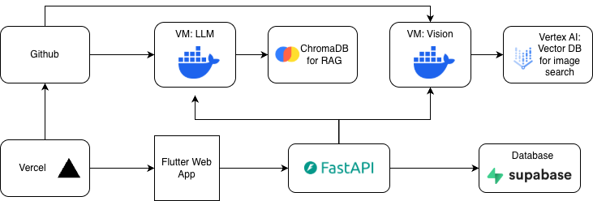

# HistoriCam

HistoriCam is a mobile-first web application that combines computer vision, geolocation, and historical data to provide instant information about landmarks. Users can point their camera at a building or landmark, and the app will identify it and provide historical context and interesting facts.

## Milestone 4 Specifics

Demo video of the full pipeline running locally: [video](https://drive.google.com/file/d/1xDccEPMYJSxnadXA0BW5U6aER20OuOAM/view?usp=sharing)

Vercel App (Vision and LLM API not connected): [App](https://ac215-histori-cam.vercel.app/)

NOTE: All evidence is located in "docs" for the submission

#### Progress updates
- [x] Log-in and Sign-up System complete with supabase 
- [x] Backend building description retrieval complete with supabase
- [x] Linked flutter APP with Vercel
- [x] Vision Model with Vertex AI integration
- [x] Vision model API which takes in image and returns most similar building's index
- [x] Added Camera switch feature to access all device cameras
- [x] Added tests for Flutter APP
- [x] LLM-RAG with ChromaDB completed. 
- [x] LLM chat API takes in text and context and returns responses
- [x] LLM Finetuning pipeline complete
- [x] CI pipeline implemented for flutter linting, tests and autodocumetation generation
- [x] CD pipeline with vercel complete
- [x] End-to-End App functional locally


NOTE: APIs are located in app/mobile/lib/services

#### TODO before MS5

- [ ] Collect more images for better image retrieval in Vertex AI
- [ ] Better finetuning for the LLM model with more data
- [ ] Build a buildings description dataset to display initial information about the buidling (Using dummy descriptions)
- [ ] Deploy Vision and Language Models to the cloud
- [ ] Have a Supabase DB tracking user history
- [ ] Implement the Location based building prediction fallback 


## Architecture

This project follows AC215 MLOps best practices with containerized microservices and GCP deployment:



We also run the data extraction sperately at the begining but it is not an active component:

```
┌──────────────────┐        ┌──────────────────┐
│  Scraper Service │ -----> │    GCP Bucket    │
└──────────────────┘        └──────────────────┘
```

## Project Structure

```
ac215_HistoriCam/
├── services/                   # Backend microservices (FastAPI)
│   ├── scraper/               # Data collection & image scraping
│   ├── api/                   # Main API service
│   └── vision/                # Vision model API
│
├── apps/mobile/               # Flutter mobile app
│
├── ml/
│   ├── llm-rag/              # RAG pipeline with ChromaDB
│   └── vision-model/         # Vision model training
│
├── data/                      # Scraped building data & images
├── docs/                      # Project documentation
└── secrets/                   # GCP credentials (gitignored)
```

## Getting Started
### Prerequisites

- [uv](https://docs.astral.sh/uv/) - Fast Python package manager
- Docker & Docker Compose
- Python 3.11+
- Flutter SDK 3.0+ (for mobile app)
- GCP account with enabled APIs:
  - Cloud Storage
  - Vertex AI
  - Cloud Run / GKE

### Initial Setup (For Local Deploument)

1. **Clone the repository**
   ```bash
   git clone https://github.com/HistoriCam/ac215_HistoriCam.git
   cd ac215_HistoriCam
   ```

2. **Set up GCP credentials**
   - Place service account JSON in `secrets/gcs-service-account.json`
   - The secrets directory is gitignored for security

## Complete Pipeline Guide
### Phase 1: Data Collection (Scraper Service)

The scraper service collects building data and images from Wikipedia and Wikimedia Commons.

#### Using Docker (Recommended)

```bash
cd services/scraper

# Build and enter container with mounted volumes
./docker-shell.sh

# Inside container - Full pipeline (names + metadata + images)
uv run python src/run.py
uv run python src/scraper/scrape_images.py /data/buildings_names_metadata.csv /data/images

# Upload to GCS with versioning (optional)
uv run python src/scraper/gcs_manager.py upload \
    $GCS_BUCKET_NAME \
    /data/images \
    /data/images/image_manifest.csv
```

**Output Files:**
- `data/buildings_names.csv` - Base building data (id, name, source_url)
- `data/buildings_names_metadata.csv` - Enriched with lat/lon/aliases from Wikidata
- `data/buildings_info.csv` - Comprehensive building information
- `data/image_data.csv` - Image data from Wikipedia baseline scrape
- `data/images/` - Downloaded images organized by building ID
- `data/images/image_manifest.csv` - Image metadata (URLs, dimensions, hashes)

#### Dataset Version Control (DVC)
TBD

### Phase 2: LLM-RAG Pipeline

The LLM-RAG service processes building information to create a retrieval-augmented generation system for answering questions about buildings.

#### Prerequisites

1. **Set up GCP credentials**
   - Place service account JSON in `secrets/gcs-service-account.json`
   - Update `GCP_PROJECT` in `docker-shell.sh` with your project ID

2. **Prepare input data**
   - Place building text files in `ml/llm-rag/input-datasets/buildings/`
   - Each file should be named `[Building Name].txt` with building information

#### Running the LLM-RAG Container

```bash
cd ml/llm-rag

# Build and start containers (ChromaDB + LLM-RAG CLI)
./docker-shell.sh
```

#### Pipeline Architecture

The LLM-RAG system:
1. **Chunks** text into manageable pieces
2. **Embeds** chunks using Vertex AI text-embedding-004
3. **Stores** embeddings in ChromaDB vector database
4. **Retrieves** relevant chunks based on query similarity
5. **Generates** responses using Gemini 2.0 Flash with retrieved context

**Docker Components:**
- **llm-rag-cli**: Main CLI for processing and querying
- **chromadb**: Vector database for storing embeddings (persistent storage)
- **Network**: Custom `llm-rag-network` for inter-container communication

**Configuration:**
- Embedding model: `text-embedding-004` (256 dimensions)
- Generative model: `gemini-2.0-flash-001`
- Vector DB: ChromaDB with cosine similarity
- Port: ChromaDB exposed on `8000`

**Output Files:**
- `ml/llm-rag/outputs/chunks-[method]-[building].jsonl` - Chunked text
- `ml/llm-rag/outputs/embeddings-[method]-[building].jsonl` - Embedded chunks
- `ml/llm-rag/docker-volumes/chromadb/` - Persistent vector database

### Phase 3: Vision Pipeline
Vision model uses vertexAI and you can follow documentation in services/vision to set up the credentials and env.

### Run Locally

```bash
cd services/vision

# 1. Set up environment (first time only)
cp .env.example .env

# Edit .env with your VERTEX_ENDPOINT_ID

# 2. Start API server
./docker-shell.sh
```

### Phase 4: Mobile Application

The Flutter mobile app provides the user interface.

#### Prerequisites

1. **Set up GCP credentials**
   - Place Supbase credentials in: secrets/supabase_key.env formatted to:

```env   
{
  "SUPABASE_KEY": "API_KEY"
}
```


#### Build Locally
```bash
cd apps/mobile

# Install dependencies
flutter pub get

# Run on connected device/emulator
flutter run

# Build for production
flutter build web --release  
flutter run --dart-define-from-file=../../secrets/supabase_key.env
```

## Team

AC215 Fall 2025

## License

MIT
