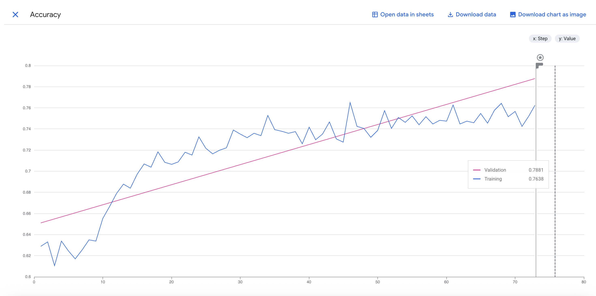
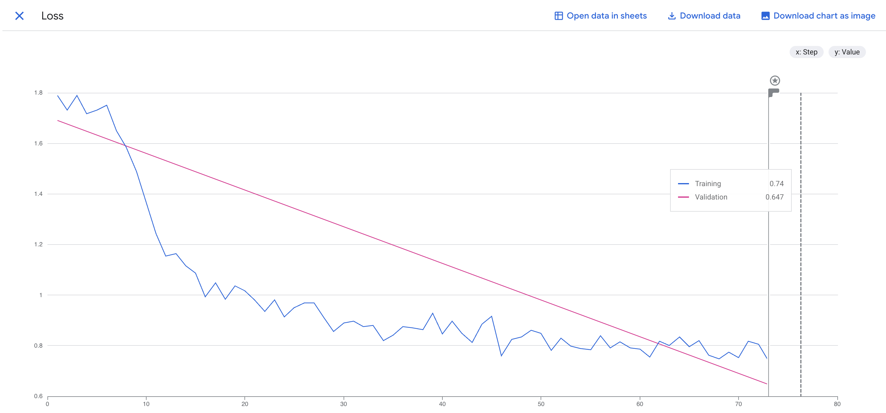
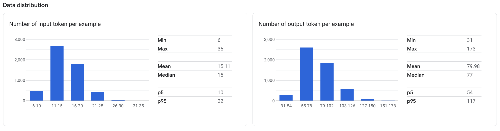

# LLM Fine-tuning

Fine tuning produces a slightly more personable tour guide with character as opposed to the generic Gemini. There is some reason to favor this, although we have not implemented integration of this fine tuned model yet. For the purposes of cost and simplicity, there is a good chance that we do not use the fine tuned model as the gains are not that significant.

Training Accuracy:

Training Number of Predictions:

Training Loss:

Data distribution:

